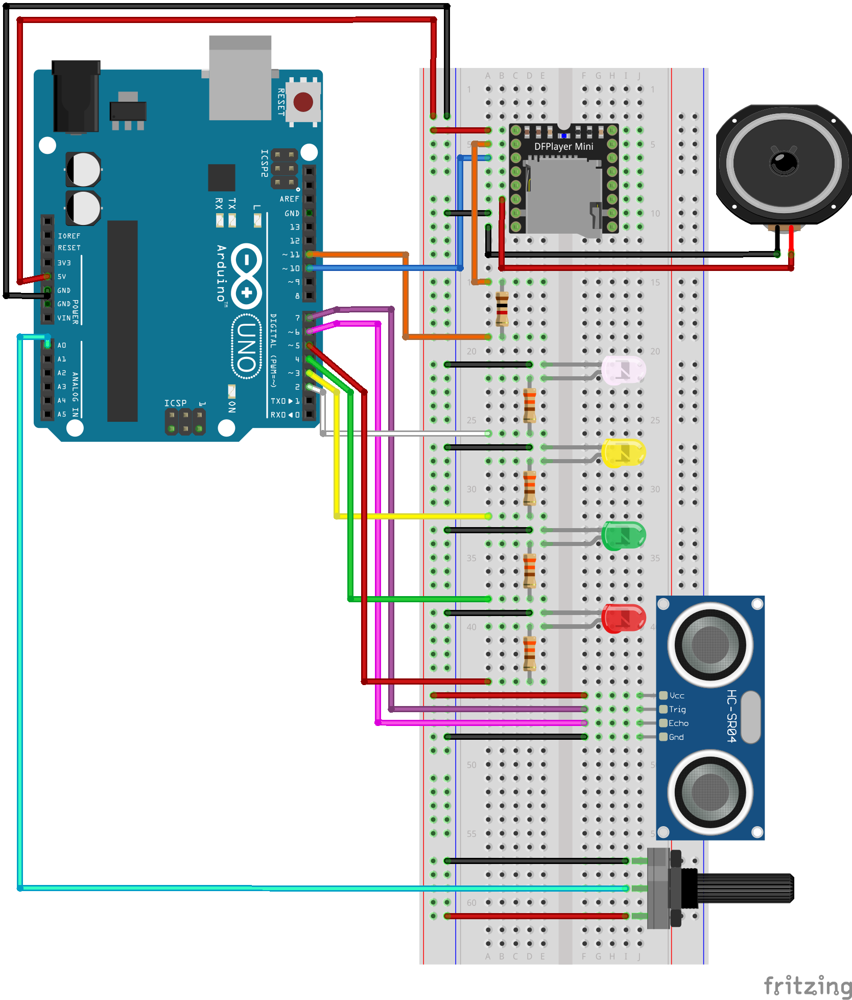
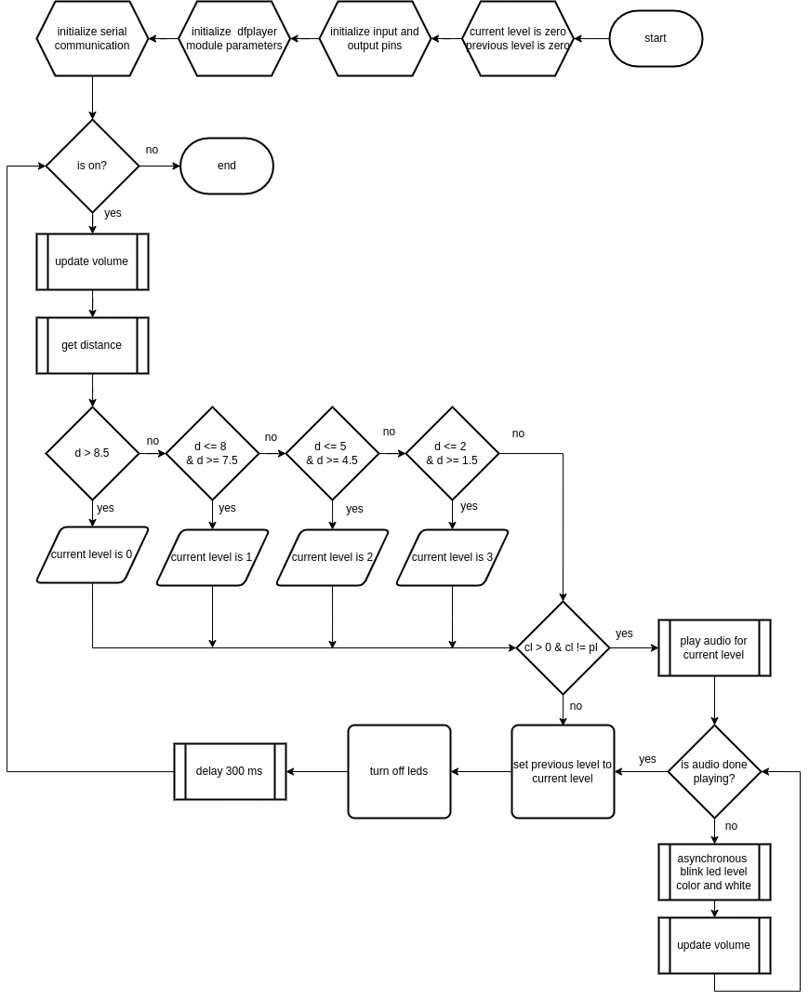

## Water Level Alert System with Arduino and MP3 player

A commission project on Liceo Senior High School project. 

The objective is to play a recording on a certain water level based on the distance captured from the ultrasonic sensor.


### Schematic Diagram




### Flowchart




### UML Class Diagram

```
+-------------------------------------+
|             MP3Player               |
+-------------------------------------+
| - mySoftwareSerial: SoftwareSerial* |
| - p_RX: int                         |
| - p_TX: int                         |
+-------------------------------------+
| + MP3Player(RX: int, TX: int)       |
| + ~MP3Player()                      |
| + initialize(): void                |
| + playTrackNumber(trackNumber: int, |
|     volume: int, waitPlayTerminated:|
|     boolean): void                  |
| + playCompleted(): boolean          |
| + serialPrintStatus(verbose: int):  |
|     int                             |
| - waitPlayIsTerminated(): void      |
| - statusOnSerial(type: uint8_t,     |
|     value: int): void               |
+-------------------------------------+
```

### Software Libraries 

- SoftwareSerial
- DFRobotDFPlayerMini
- Arduino IDE


### Components

- Arduino UNO
- DF MP3 Player
- SD Card
- 1k Ohm Resistor
- 4x 330 Ohm Resistor
- Speaker
- Ultrasonic Sensor
- Potentiometer
- Jumper Wires
- 4x LED Colored
- Jumper Wires
